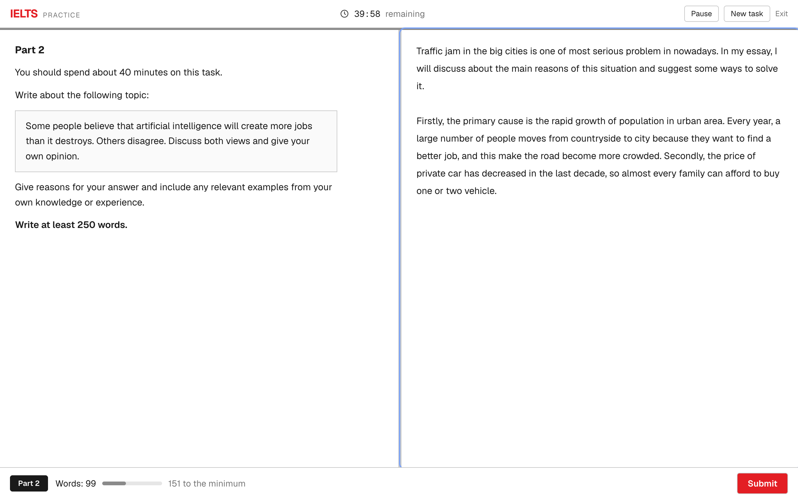
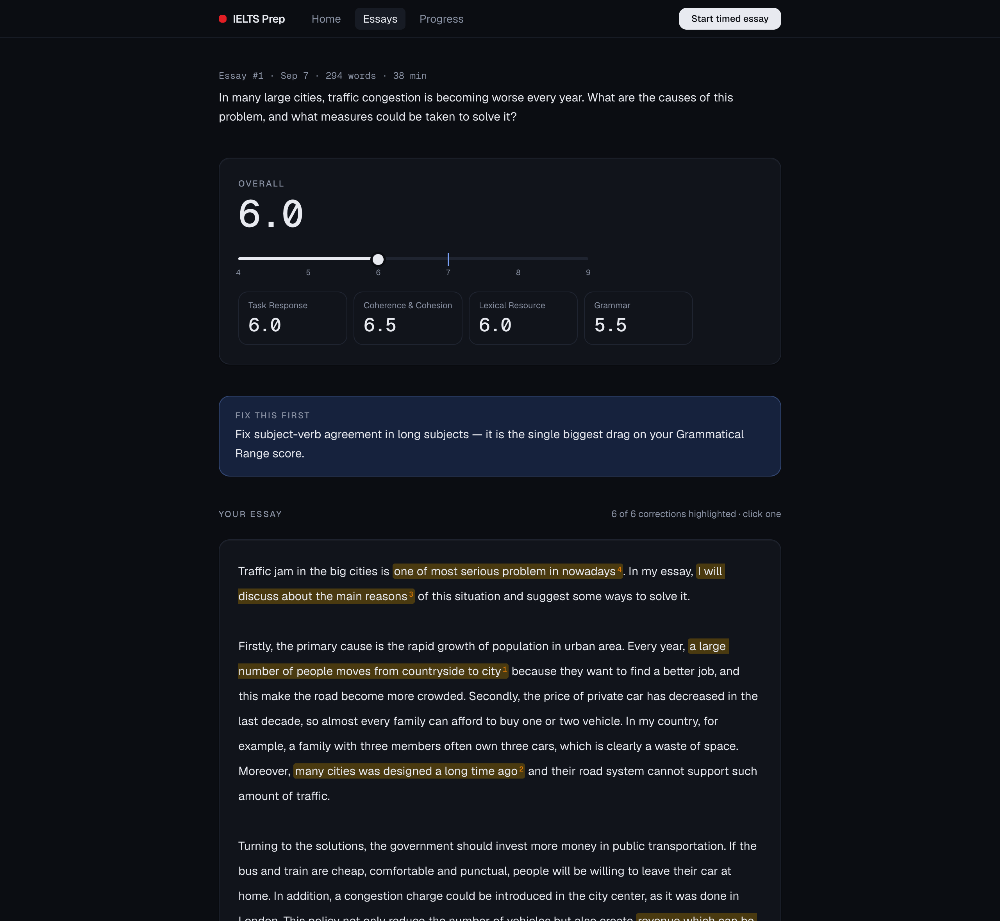
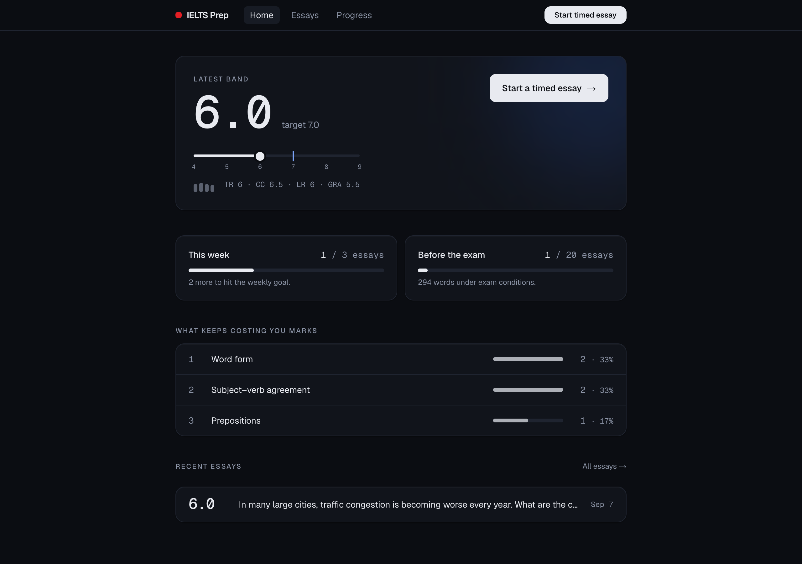
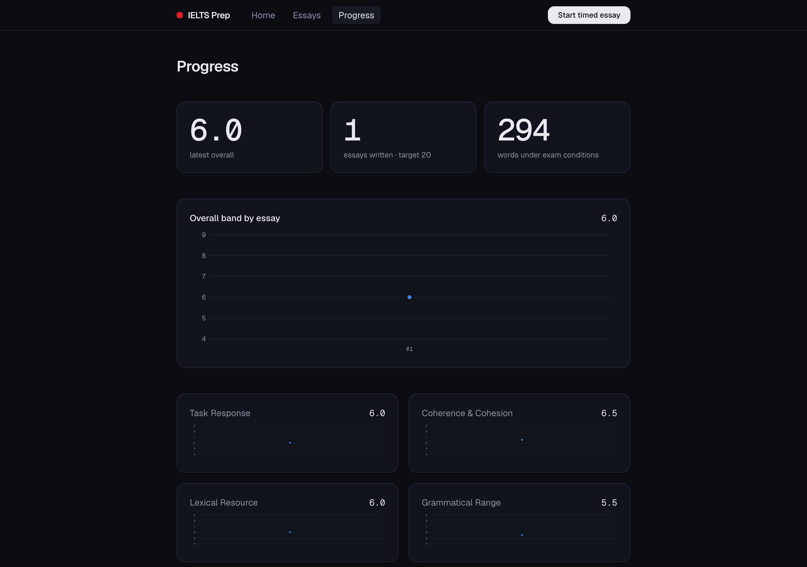

# IELTS Prep

A feedback loop for IELTS Academic **Writing Task 2**. Write under exam
conditions, get marked against the official band descriptors in about a minute,
and see whether the score is actually moving.

Runs on your own machine. One SQLite file, no accounts, no deployment.

> **Not affiliated with IELTS.** A band score from this tool is not an IELTS band
> score — see [Sources and attribution](#sources-and-attribution) and
> [What it can't do](#what-it-cant-do).

---

## Why

Self-study for IELTS has one hole in it: you write essays and nobody marks them.
Mistakes you don't know are mistakes stay with you, which is the usual reason
candidates plateau at 6.0–6.5. A tutor fixes that but costs money and turns work
around in a day or two.

There is no shortage of practice material — Cambridge 16–19 and free YouTube is
more than anyone needs. What's missing is a **fast, cheap feedback loop**. So this
is a feedback tool, not a course library.

---

## The exam screen

A replica of the computer-delivered test: split panes with a draggable divider,
the official task wording, a countdown that warns at 10 and 5 minutes, and word
count against the 250 minimum. Fixed light theme, no app navigation, no
spell-check — what you practise on is what you sit in front of on the day.



Drafts are saved as you type, so a stray refresh can't cost you 40 minutes.

## The marking

The overall band and the four criteria, then the one thing to fix first — then
**your essay with every correction highlighted where you made it**, numbered to
match the list below. Click a highlight to see the fix and the rule it broke.



Each criterion is justified with a sentence quoted from your own essay, because a
band with no evidence behind it is not worth reading.

## The trend

Latest band on the 4–9 ladder against your target, essays this week against a
3-a-week habit, total against 20 before exam day, and the error categories
costing you the most marks.



Per-criterion trends over every essay you've written:



---

## Quickstart

```bash
npm install
cp .env.local.example .env.local    # pick a provider block, add a key
npm run serve                       # http://localhost:3000
```

The schema is created and 32 Task 2 prompts seeded on first boot.

### Choosing a provider

Marking talks to any **OpenAI-compatible** endpoint, chosen by three environment
variables — no code change to swap between them.

| | Cost | Trade-off |
|---|---|---|
| **Groq** free tier | free | rate-limited; easiest start |
| **OpenRouter** + DeepSeek / Qwen | ~$0.001–0.003 per essay | needs a minimum top-up |
| **Ollama** / LM Studio, local | free | a 7–14B model marks noticeably worse |

```bash
LLM_BASE_URL=https://api.groq.com/openai/v1
LLM_API_KEY=gsk_...
LLM_MODEL=llama-3.3-70b-versatile
```

Model size shows up directly in marking quality. A small local model will invent
evidence, miss agreement errors, and hand band 7.5 to a band 6 essay. If you run
local, trust the corrections and treat the band as noise.

---

## Does it inflate? Measure it

```bash
npm run calibrate
```

Marks the two official sample responses that real examiners scored **band 5.5**
and **band 7.5**, and reports the gap:

```
  official-task2-band-5.5
    examiner 5.5   tool 6.0   delta +0.5
  official-task2-band-7.5
    examiner 7.5   tool 7.0   delta -0.5

  mean delta 0.0  →  close enough to a real examiner to be useful as a compass
```

Run it once when you pick a model, and again if you change models. Mean delta
**≥ +0.5** means it flatters you — subtract that from every band it gives you.
**≥ +1.0** means ignore its numbers and read only the corrections.

Two LLM calls. Writes nothing to your database.

---

## How the marking works

The part that decides whether any of this is worth trusting:

- **Official descriptors in context.** `src/lib/descriptors.ts` is the Writing
  Task 2 table from IELTS's own band descriptors (May 2023), bands 9–4. Not a
  summary, not the model's idea of what IELTS wants.
- **Evidence before score.** The model must quote your text for each criterion
  before awarding a band. No floating numbers.
- **Told to mark down.** Automated markers inflate IELTS scores. The prompt says
  so, and says to take the lower band whenever it's torn.
- **Schema-validated.** `json_schema` first, then `json_object`, then plain text —
  small models support none of the three — with markdown fences stripped and the
  result checked against a Zod schema either way.
- **Arithmetic in code.** Bands snap to the half-band grid, and the overall band
  is computed with the official rounding rule rather than asked of the model.

---

## What it can't do

An LLM band is not an examiner band. Use it as a compass — *am I improving, what
do I keep getting wrong* — not as a measurement. **Before the real exam, have a
human tutor mark 3–4 essays** so you know how far off this runs.

Deliberately absent, because they wouldn't raise a score: accounts, payments,
Listening and Reading modules, a bank of copied past papers, deployment, mobile
layout.

Planned, but only after two weeks of the writing loop actually being used:
speaking practice (Part 2 cue card → record → transcript → fluency metrics) and a
dedicated error-log view. The `speaking_attempts` table and 8 cue cards are
already seeded, and error rows are written on every marking, so `/stats` shows
category counts today.

---

## Commands

| | |
|---|---|
| `npm run serve` | build and run (low memory, use this day to day) |
| `npm run dev` | dev server with hot reload |
| `npm run calibrate` | mark the official samples, report the gap |
| `npm run resources` | re-download all 30 official IELTS PDFs |
| `npm run screenshots` | regenerate the images in this README |

## Layout

```
src/app/write/           the exam screen
src/app/essays/[id]/     the review screen
src/app/api/             prompts/random · essays · essays/[id]/assess · stats · calibrate
src/lib/assess.ts        the marking prompt, schema, and band arithmetic
src/lib/descriptors.ts   the official Task 2 band descriptors
src/lib/calibration.ts   the examiner-marked essays used by npm run calibrate
src/lib/db.ts            schema + seed, one connection per process
```

Next.js (App Router) · SQLite via better-sqlite3 · any OpenAI-compatible LLM ·
Tailwind. No server to install, no container.

## Reference PDFs

`resources/` holds every official IELTS document this project was built from —
gitignored, fetched with two commands:

```bash
npm run resources    # 30 PDFs: band descriptors, answer keys, tapescripts
npm run inspera      # the 20 interactive tasks, extracted to text
```

The interactive tasks are browser-only — there is no file behind them — so
`npm run inspera` drives a real browser through IELTS's player and saves what it
renders. That yields the **full Academic Reading passages with their questions**,
the listening question sheets, and the Writing prompts. Audio still can't be
captured, but the Listening folder has all 8 **recording transcripts**: do a task
online, then read exactly what was said and see what you misheard.

`resources/INDEX.md` describes every file and records the raw-score conversion:
**30/40 in both Listening and Reading** for a band 7.

## Sources and attribution

Every piece of IELTS material here comes from the preparation resources published
free by IELTS, and remains the property of the IELTS partners (British Council,
IDP: IELTS Australia, Cambridge University Press & Assessment). It is reproduced
for personal exam preparation, with the source named at the top of each file.

- [Sample test questions (Academic)](https://ielts.org/take-a-test/preparation-resources/sample-test-questions/academic-test)
- [Writing band descriptors, May 2023](https://ielts.org/cdn/Guides/ielts-writing-band-descriptors.pdf) → `src/lib/descriptors.ts`
- [Sample responses with band scores and examiner comments](https://ielts.org/cdn/computer-delivered-sample-tests-academic-writing/ielts-academic-writing-example-responses-to-parts-1-and-2-with-band-scores-and-examiner-comments.pdf) → `src/lib/calibration.ts`
- [Academic Writing sample tasks, 2023](https://ielts.org/cdn/Sample-tests/ielts-academic-writing-sample-tasks-2023.pdf) → 2 of the 32 prompts, and the task wording on the exam screen

The other 30 Task 2 prompts and all 8 speaking cue cards were written for this
project and are not IELTS material.
